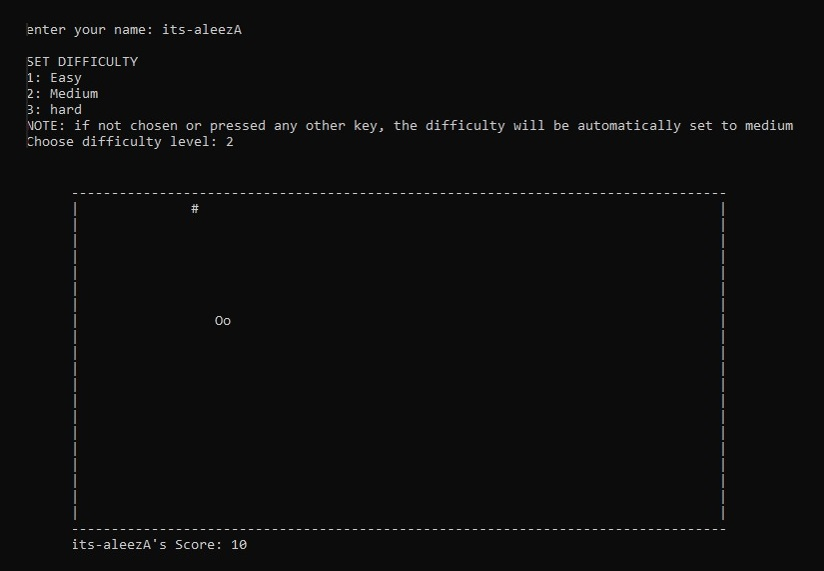

# 🐍 Console Snake Game in C++

A console-based Snake game implemented in C++ using basic rendering and logic. It features score tracking, increasing tail length, food generation, wall collision, and difficulty selection. The game runs directly in the terminal using simple character-based graphics.

---

## 📖 Game Overview

This project is a recreation of the classic Snake game for the command line, written entirely in C++. The game uses `conio.h` and `windows.h` for rendering and input handling, making it compatible with Windows terminals.

- The player controls the snake using **WASD keys**
- Eating food (`#`) increases the tail length and score
- Collision with walls or the tail ends the game
- The player can choose between Easy, Medium, and Hard difficulty

---

## 🎮 Controls

| Key | Action       |
|-----|--------------|
| `W` | Move Up      |
| `S` | Move Down    |
| `A` | Move Left    |
| `D` | Move Right   |
| `X` | Exit Game    |

---

## ⚙️ Features

- Classic snake game logic (growth, food, wall collision)
- Terminal-based rendering using ASCII characters
- Adjustable difficulty levels (speed)
- Clean and modular structure
- Simple user interface via text input

---

## 🧪 Requirements

- **OS:** Windows
- **Compiler:** Any C++ compiler that supports `conio.h` and `windows.h` (e.g. Turbo C++, Visual Studio, Code::Blocks with MinGW)

---

## 💻 Source Code

The complete source code is in the `code/` directory:

- [`snake_game.cpp`](code/snake_game.cpp)

---

## 📸 Gameplay Demo

---

## 👤 Author

- [Aleeza Rizwan](https://github.com/its-aleezA)
